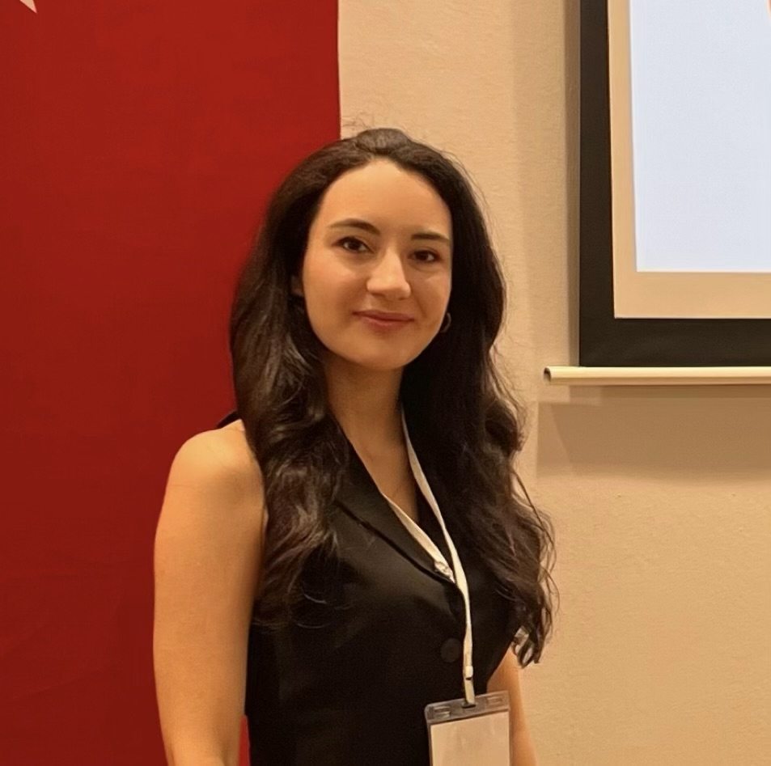

{ width=250px fig-align="center" .pastel-frame }

# Education

-   B.S., Industrial Engineering, TOBB Economics and Technology University, Turkey, 2015 - 2019
-   M.S., Industrial Engineering, Bilkent University, Turkey, 2019 - 2022
-   Ph.D., Industrial Engineering, Hacettepe University, Turkey, 2026 - ongoing

# Work Experience

## Employements

1.  ASELSAN, Project Engineer, 2022- ongoing

2.  Bilkent University, Research Assistant, 2019 - 2022

## Internships

1.  TUSAŞ, Intern in Production Planning and Control Department, April 2019- August 2019

2.  HAVELSAN, Intern in Technology and Innovation Management Department, September 2018- December 2018

3.  Türk Traktör, Intern in World Class Manufacturing Department, May 2017- August 2017

# Projects

1.  TUBİTAK 2241

# Competencies

R, Quarto, Git, Cplex, LaTeX, Python

  <a href="assets/cv.pdf" target="_blank" class="cv-button">
   📑 View My CV
  </a>

